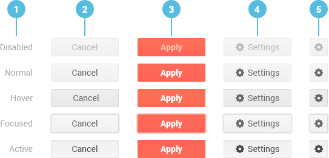

# Button Overview

The Kendo UI Button is a React component that allows the user to achieve a UI functionality by clicking on it. The appearance of the Button can be configured so as to show textual content only, or to display a predefined icon, an image, or a custom icon, or yet a combination of textual and image content. Buttons can be enabled or disabled, and allow the attaching of click events to them.

The Button is a component that is part of the Buttons `npm` package of the Kendo UI suite for React.

**Figure 1: A Button template component for React**



1. Button interaction states
2. Default Button
3. Primary Button
4. Button with an Icon
5. Icon-Only Button

## Demos

### Default Setup

The example below demonstrates the default setup of a Kendo UI Button for React.

```html-preview
    <!--font awesome-->
    <link rel="stylesheet" href="https://maxcdn.bootstrapcdn.com/font-awesome/4.5.0/css/font-awesome.min.css">

    <div id="app"></div>
```
```jsx
    class ButtonContainer extends React.Component {
        constructor(props) {
            super(props);
            this.state = {
                disabled: false
            };
        }
        onClick = () => {
            this.setState({ disabled: !this.state.disabled });
        }
        render() {
            return (
                <div>
                    <KendoReactButtons.Button onClick={this.onClick}>Button 1</KendoReactButtons.Button>
                    <KendoReactButtons.Button disabled={this.state.disabled}>Button 2</KendoReactButtons.Button>
                </div>
            );
        }
    }

    ReactDOM.render(
        <div>
            <p>Button</p>
            <KendoReactButtons.Button>Button</KendoReactButtons.Button>
            <p>Disabled Button</p>
            <KendoReactButtons.Button disabled>Button</KendoReactButtons.Button>
            <p>Primary Button</p>
            <KendoReactButtons.Button primary>Primary Button</KendoReactButtons.Button>
            <p>Button with icon</p>
            <KendoReactButtons.Button icon="refresh">Refresh</KendoReactButtons.Button>
            <p>Button with icon (imageUrl)</p>
            <KendoReactButtons.Button imageUrl="http://demos.telerik.com/kendo-ui/content/shared/icons/sports/snowboarding.png">Snowboarding</KendoReactButtons.Button>
            <p>Button with a custom icon (iconClass) [FontAwesome icon]</p>
            <KendoReactButtons.Button iconClass="fa fa-key fa-fw">FontAwesome icon</KendoReactButtons.Button>
            <p>Toggleable Button</p>
            <KendoReactButtons.Button togglable>Togglable button</KendoReactButtons.Button>
            <p>onClick event handler</p>
            <ButtonContainer />
        </div>,
        document.getElementById('app')
    );
```

## Configuration

### Enable and Disable

By default, the Kendo UI Button for React is enabled.

```html-preview
    <div id="app"></div>
```
```jsx
    ReactDOM.render(
        <KendoReactButtons.Button>Button</KendoReactButtons.Button>,
        document.getElementById('app')
    );
```

When disabled, the Button is displayed but does not operate.

```html-preview
    <div id="app"></div>
```
```jsx
    ReactDOM.render(
        <KendoReactButtons.Button disabled>Disabled Button</KendoReactButtons.Button>,
        document.getElementById('app')
    );
```

### Set Primary Buttons

Depending on your project, the Button enables you to add visual weight to it and make it primary.

```html-preview
    <div id="app"></div>
```
```jsx
    ReactDOM.render(
        <KendoReactButtons.Button primary>Primary Button</KendoReactButtons.Button>,
        document.getElementById('app')
    );
```

### Add Icons

The Kendo UI Button for React enhances textual content by providing the option to add icons&mdash;image, predefined, or custom ones. Taking web standards into consideration, it is better to use a background image as the icon does not represent structural content, but is simply decoration.

**Use `icon`**

The [Kendo UI built-in icons](http://demos.telerik.com/kendo-ui/styling/icons) are applied through the [`icon`](#icon-string) property and displayed as the background of the Button component.

```html
    <div id="app"></div>
```
```jsx
    ReactDOM.render(
        <KendoReactButtons.Button icon="refresh">Refresh</KendoReactButtons.Button>,
        document.getElementById('app')
    );
```

**Use `imageUrl`**

Image icons are applied through the [`imageUrl`](#imageurl-string) property.

```html
    <div id="app"></div>
```
```jsx
    ReactDOM.render(
        <KendoReactButtons.Button imageUrl="http://demos.telerik.com/kendo-ui/content/shared/icons/sports/snowboarding.png">Snowboarding</KendoReactButtons.Button>,
        document.getElementById('app')
    );
```

**Use `iconClass`**

FontAwesome or other font icons also can reside in a Kendo UI Button for React. They are implemented by setting the required third-party CSS classes through the [`iconClass`](#iconclass-string) property.

```html
    <!--font awesome-->
    <link rel="stylesheet" href="https://maxcdn.bootstrapcdn.com/font-awesome/4.5.0/css/font-awesome.min.css">

    <div id="app"></div>
```
```jsx
    ReactDOM.render(
        <KendoReactButtons.Button iconClass="fa fa-key fa-fw">FontAwesome icon</KendoReactButtons.Button>,
        document.getElementById('app')
    );
```

To see the full list of Kendo UI web font icons, refer to the [related article](http://docs.telerik.com/kendo-ui/styles-and-layout/icons-web).

### Toggle

The Button supports also visual styling that indicates if it is active. This functionality is set through the [`togglable`](#togglable-boolean) property. By default, `togglable` is set to `false`.

```html
    <div id="app"></div>
```
```jsx
    ReactDOM.render(
        <KendoReactButtons.Button togglable>Togglable button</KendoReactButtons.Button>,
        document.getElementById('app')
    );
```

### Handle Events

Through setting the [`onClick`](#onclick-function) property, an event handler can be attached to the Button. Disabled Buttons will not execute the attached event handler.

```html
    <div id="app"></div>
```
```jsx
    class ButtonContainer extends React.Component {
        constructor(props) {
            super(props);
            this.state = {
                disabled: false
            };
        }
        onClick = () => {
            this.setState({ disabled: !this.state.disabled });
        }
        render() {
            return (
                <div>
                    <KendoReactButtons.Button onClick={this.onClick}>Button 1</KendoReactButtons.Button>
                    <KendoReactButtons.Button disabled={this.state.disabled}>Button 2</KendoReactButtons.Button>
                </div>
            );
        }
    }

    ReactDOM.render(
        <ButtonContainer />,
        document.getElementById('app')
    );
```

Same goes for the [`onMouseDown`](#onmousedown-function) and [`onMouseUp`](#onmouseup-function) properties.

```html
    <div id="app"></div>
```
```jsx
    class ButtonContainer extends React.Component {
        constructor(props) {
            super(props);
            this.state = {
                disabled: false
            };
        }
        toggleButton = () => {
            this.setState({ disabled: !this.state.disabled });
        }
        render() {
            return (
                <div>
                    <KendoReactButtons.Button onMouseDown={this.toggleButton} onMouseUp={this.toggleButton}>Button 1</KendoReactButtons.Button>
                    <KendoReactButtons.Button disabled={this.state.disabled}>Button 2</KendoReactButtons.Button>
                </div>
            );
        }
    }

    ReactDOM.render(
        <ButtonContainer />,
        document.getElementById('app')
    );
```

### Set Tab Indexes

By setting the [`tabIndex`](#tabindex-number) property, you indicate the order in which buttons are selected through the `Tab` key.

```html
    <div id="app"></div>
```
```jsx
    ReactDOM.render(
        <div>
            <KendoReactButtons.Button tabIndex={2}>Button 2</KendoReactButtons.Button>
            <KendoReactButtons.Button tabIndex={1}>Button 1</KendoReactButtons.Button>
            <KendoReactButtons.Button tabIndex={3}>Button 3</KendoReactButtons.Button>
        </div>,
        document.getElementById('app')
    );
```

For detailed information on the Kendo UI Button configuration for React, refer to the [Button client-side API documentation]().

## Keyboard Navigation

Below is the list with the keyboard shortcuts the Button supports.

| SHORTCUT                            | DESCRIPTION         |
|:---                                 |:---                 |
| `Enter` or `Space`                  | Click the Button.   |
| `Tab`                               | Focus the Button.   |

## Accessibility

The Button is WAI ARIA-accessible through the `Tab` key. The `aria-disabled` property defines the accessibility setting when an attribute is disabled.

## Suggested Links

* [Client-Side API Reference for the Kendo UI Button Component]()
